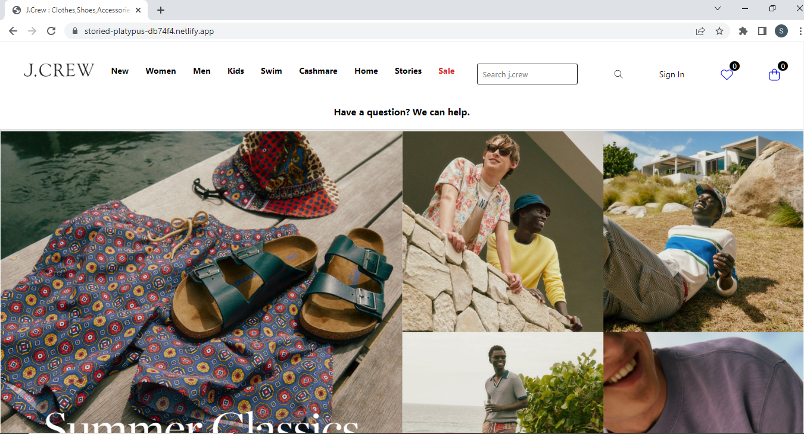
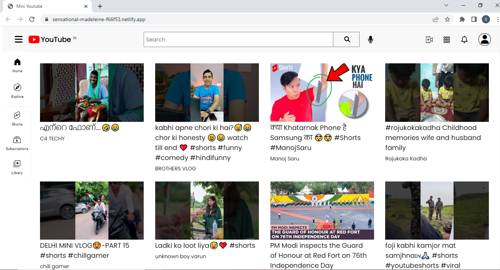
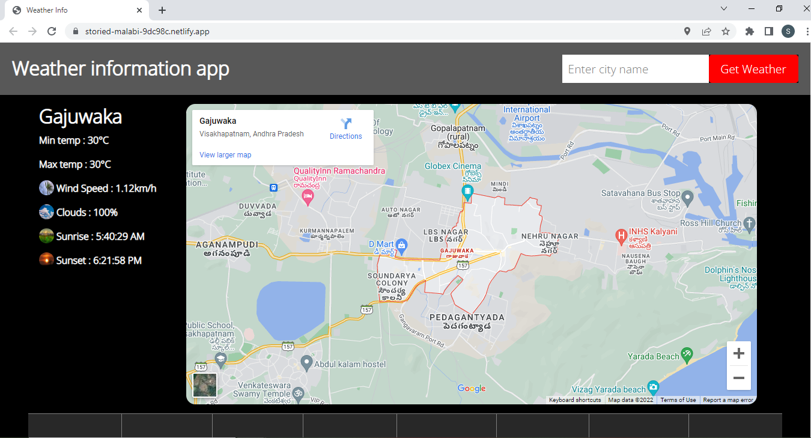
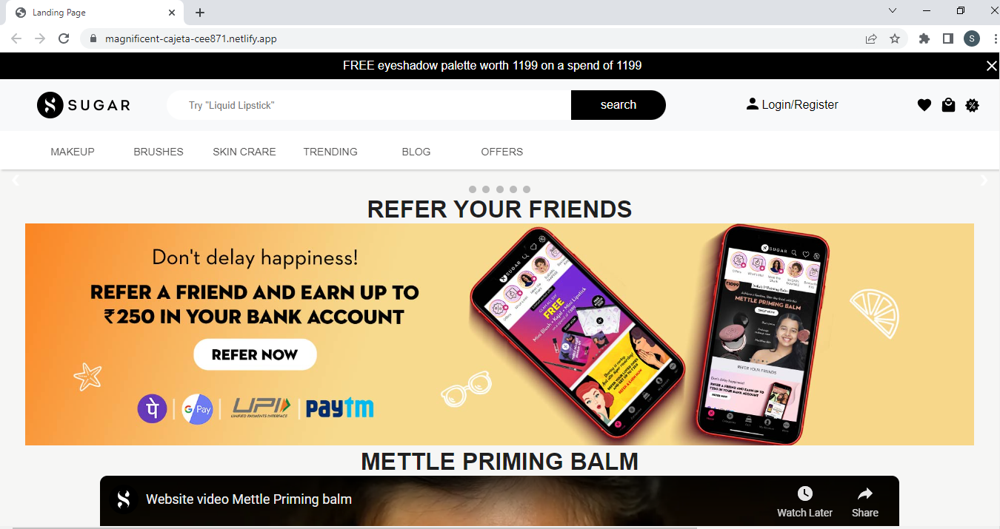

*   [About](#about)
*   [Skills](#skills)
*   [Projects](#projects)
*   [Contact](#contact)

# Hi, I'm  
# Shaik Sirajuddin
## Java Backend Developer

About Me
========

A passionate and aspiring full-stack developer, capable of designing, building and maintaining Java-based web applications by writing well-designed and efficient code. Cloned various projects individually and collaboratively, and also practiced 1000+ hours of coding and DSA. Looking forward to join a challenging work environment to contribute my skills to the growth of myself and the company. Willing to learn new skills and contribute to the organization at all stages of the SDLC.

Skills
======
      

My Projects
===========
### J.Crew Clone

### Youtube Mini App Clone

### Weather App Clone

### Sugar Cosmetics Clone

Contact Me
==========

[shaiksirajuddin135@gmail.com](mailto:shaiksirajuddin135@gmail.com)

[My Portfolio](https://Sirajuddin135.github.io)

[Download Resume](Shaik_Sirajuddin_Resume.pdf)